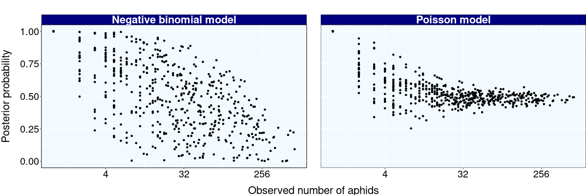
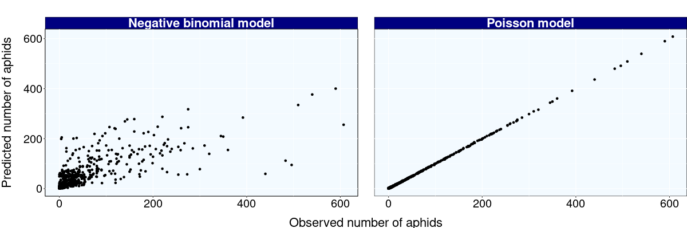

```{css, echo=FALSE}
pre {
  max-height: 300px;
  overflow-y: auto;
}

pre[class] {
  max-height: 300px;
}

pre, code {white-space:pre !important; overflow-x:scroll !important}

.question {
  text-indent: 5em;
  text-align: justify;
} 

.indented_response {
  text-indent: 5em;
  color: #000080;
  text-align: justify;
  margin-bottom: 30px;
} 

.response {
  color: #000080;
  text-align: justify;
  margin-bottom: 30px;
  margin-left: 40px
} 

.rouge {
  color: red;
  text-align: justify;
  margin-bottom: 30px;
  margin-left: 40px
} 
```


```{r, results = FALSE, cache = TRUE}
library(ggplot2);   library(dplyr);   library(rjags);   library(kableExtra)
```

# Reviewer 1

::: question
In the manuscript 'A hierarchical model to evaluate pest treatments from prevalence and intensity data', Favrot & Makovski present a new and welcome (Bayesian) method for the (meta-)analysis of countable 'infection' units on individual hosts, where the recorded variable may be either the proportion of 'infected' hosts (prevalence) or the mean number of infection units per individual host (intensity), or both quantities. Then, a simulation study is used to demonstrate that intensity data provide more accurate estimates than prevalence data (especially for abundant 'infections'), and to assess the accuracy of the estimates depending on the number of trials. The provided code and convergence seems good. 
:::

::: question
Before starting my comments, I wish to apologize deeply for the inconvenience caused to the authors and editor by the time taken to review the manuscript. Besides, I did not find any line numbering; thus, my comment below only vaguely refer to paragraph or page numbers.
:::

::: indented_response
Ajouter des numéros de lignes dans mes fichiers.
:::

::: question
A general comment : the article focusses on aphid abundance on plants sampled during field trials designed to compare the efficacy of various pest control options, but the framework is more generic (and might be used e.g. in animal/human epidemiology) and the authors may highlight this point in the abstract, introduction and/or discussion.
::: 

::: indented_response         
Ajouter une phrase dans la conclusion pour souligner ce point.
:::


## Major comments

::: question
My only methodological comment relates to the choice of a Poisson distribution for W, which is the number of aphids on each plant. Because aphids land and initiate exponentially growing clonal populations at different times on different plants of the same trial x treatment x block x time combination, W should have an overdispersed Poisson distribution (e.g., negative binomial), instead of a Poisson distribution (eq. 1). Thus, Y (the sum of N independent W variables) should not have a Poisson distribution (eq. 3). It would be interesting to test whether an overdispersed Poisson distribution is better than a Poisson distribution for fitting the unaggregated data on the number of aphids on each of the N_i (i.e. 10 here) sampled plants (gaining statistical power from the multiple trials). Although the authors state (in part 2.1) that such data are not available to the authors, these raw data are classically recorded and might be provided by the unspecified colleagues who conducted the field trials (by the way, the institutions that performed the field trials should be mentioned more explicitly).
::: 

::: indented_response         
Ce commentaire remet en question le modèle que l'on utilise et propose d'en utiliser un autre : la négative binomiale. La négative binomiale permet de gérer la surdispersion. Ce commentaire nous a fait remarquer que nous n'avions pas vérifié l'ajustement aux données de notre modèle. La première étape sera donc de faire cette vérification. On la fera en appliquant la méthode du "posterior predictive checking", qui consiste, pour chaque observation, à calculer la probabilité que le modèle propose une valeur plus extrême que celle de l'observation considérée. On fera cette vérification uniquement sur les données réelles. La seconde étape sera de coder le modèle reposant sur la loi négative binomiale et de le comparer au modèle de Poisson en utilisant le posterior predictive checking : on fera un scatter plot des proba à posteriori de dépasser les valeurs extrêmes selon les deux modèles (probas d'un modèle en abscisse et probas de l'autre en ordonné). 

Notre stratégie de réponse dépendra des résultats de ces deux premières étapes.
:::

[paragraphe biblio pour justifier notre choix]

Nous avons implémenté le modèle négatif binomial sur les données réelles et nous avons comparé son ajustement aux données par rapport au modèle de Poisson, en utilisant la méthode probability posterior checking **[ref]**. 

Le modèle est donné par 

$$
    W_{ijkts}\sim\mathcal{NB}\big(r,\ \lambda_{ijkt}\big)
$$

Where $\lambda_{ijkt}$ is the mean of $W_{ijkts}$ and $r$ is the overdispersion parameter. The model on $\lambda_{ijkt}$ is the same as the one of the Poisson model, but without the term $\epsilon_{ijkt}$ :

$\begin{align}&\log\ \lambda_{ijkt} = \alpha_0 + \beta_{0i} + \gamma_{0j}  + (\alpha_1 + \gamma_{1j})\ X_t + u_{ij}\label{eq:test}\tag{1}\end{align}$

This settings leads to the following distribution for $Y$ and $Z$ :
    
$$Y_{ijkt} \sim\mathcal{NB}\big(N_ir,\ N_i\lambda_{ijkt}\big)\ \hspace{1cm} \ Z_{ijkt} \sim \mathcal{B}\big(N_{i},\ \pi_{ijkt}\big)$$
    
where $\pi_{ijkt} = 1-\big(r\ /\ (r + \lambda_{ijkt})\big) ^ r$ is the probability of $W_{ijkts}$ beeing postitive. 

La figure  ci-dessous montre les résultats obtenus pour les deux modèles. On voit que l'ajustement au donné est meilleur avec le modèle de poisson.




{#fig-Observed_vs_predicted_values_real_data}

<br>
Nous avons aussi vérifié par simulation que notre modèle était pertinent. Nous avons simulé selon le modèle de la négative binomiale puis nous avons inférer avec 2 modèles : 
  - le modèle négative binomiale
  - notre modèle de poisson surdispersé

Le code est donné ci-dessous. Les résultats montre qu'encore une fois le modèle de poisson s'ajuste mieux aux données même si celles si ont été simulé avec le modèle de la négative binomiale.


**Simulation des données**


```{r, cache=TRUE}

source(file = "simu_data_NegB.R")

I = 30
K = 4   # number of blocks
S = 10   # number of beets in the sample

r = 15   # overdispersion parameter 

alpha_0 = 0.5
alpha_1 = 0.16

gamma_0 = c(0, - 0.13, - 1.13, - 1.24);  
gamma_1 = c(0, 0.24, - 0.14, - 0.15);  

X_t = c(6, 12)

sigma2 = 1.87;  
chi2 = 0.27

set.seed(seed = 1)

data_simu = simu_data_NegB(I = I, K = K, S = S, r = r, alpha_0 = alpha_0, alpha_1 = alpha_1, 
                      gamma_0 = gamma_0, gamma_1 = gamma_1, X_t = X_t, sigma2 = sigma2, chi2 = chi2)

ggplot(data_simu) +
    geom_histogram(aes(x = Y), binwidth = 5)
```


```{r, cache = TRUE}
# Making the two scenarios [100% Z - 0% Y] and [0% Z - 100% Y]
dataZ = data_simu %>% mutate(Y = NA)
dataY = data_simu %>% mutate(Z = NA)
```


**Ecriture des modèles**

```{r, cache = TRUE}
# Negative binomial model

negative_binomial_model = "
model {

    ###################### Likelyhood ######################
    for (i in 1:Q){
        Y[i] ~ dnegbin(p[i], N[i] * r)
        p[i] <- r / (r + lambda[i]) 

        Z[i] ~ dbinom(pi[i], N[i])
        pi[i] = 1 - p[i] ^ r

        log(lambda[i]) = beta0[TRIAL[i]] + gamma0[TREATMENT[i]] + (alpha1 + gamma1[TREATMENT[i]]) * TIME[i] + u[TRIAL_TREATMENT[i]]

        pred[i] ~ dnegbin(p[i], N[i] * r)            
    }

    for (j in 1:K){
        beta0[j] ~ dnorm(alpha0, invsigma)
    }

    for (c in 1:M){
        u[c] ~ dnorm(0, invchi)
    }

    gamma0[1] = 0
    gamma1[1] = 0

    ######################## Priors ########################
    for (s in 2:L){
        gamma0[s] ~ dnorm(0, 0.001)
        gamma1[s] ~ dnorm(0, 0.001)
    }

    alpha0 ~ dnorm(0, 0.001)
    alpha1 ~ dnorm(0, 0.001)
    sigma ~ dunif(0, 10)
    chi ~ dunif(0, 10)
    r ~ dunif(0, 50)

    ################### Derived Quantities #################
    invsigma = pow(sigma, -2)
    invchi = pow(chi, -2)
}
"

writeLines(negative_binomial_model, con  =  "negative_binomial_model.txt")


# Poisson model

poisson_model = "
model {

    ###################### Likelyhood ######################
    for (i in 1:Q){
        Y[i] ~ dpois(N[i] * lambda[i])
        Z[i] ~ dbinom(pi[i], N[i])
        log(lambda[i]) = beta0[TRIAL[i]] + gamma0[TREATMENT[i]] + (alpha1 + gamma1[TREATMENT[i]]) * TIME[i] + u[TRIAL_TREATMENT[i]] + epsi[i]
        pi[i] = 1 - exp(- lambda[i])
        epsi[i] ~ dnorm(0, inveta)
        pred[i] ~ dpois(N[i] * lambda[i])
    }

    for (j in 1:K){
        beta0[j] ~ dnorm(alpha0, invsigma)
    }

    for (c in 1:M){
        u[c] ~ dnorm(0, invchi)
    }

    gamma0[1] = 0
    gamma1[1] = 0

    ######################## Priors ########################
    for (s in 2:L){
        gamma0[s] ~ dnorm(0, 0.001)
        gamma1[s] ~ dnorm(0, 0.001)
    }

    alpha0 ~ dnorm(0, 0.001)
    alpha1 ~ dnorm(0, 0.001)
    sigma ~ dunif(0, 10)
    chi ~ dunif(0, 10)
    eta ~ dunif(0, 10)

    ################### Derived Quantities #################
    invsigma = pow(sigma, -2)
    invchi = pow(chi, -2)
    inveta = pow(eta, -2)
}
"

writeLines(poisson_model, con  =  "poisson_model.txt")
```


**Inference**

```{r, results = FALSE, cache = TRUE}
# Function to make inference from the data ##########################################################################################
finf <- function(model, df, nadapt, niter){

    Y = df$Y;   Q = length(Y);   N = df$N;   Z = df$Z

    TRIAL = as.numeric(as.factor(as.character(df$trial)));   TREATMENT = as.numeric(as.factor(as.character(df$treatment)));   

    TIME = as.numeric(df$X_t);   TRIAL_TREATMENT = as.numeric(as.factor(as.character(df$trial_treatment)));   

    K = length(unique(TRIAL));   L = length(unique(TREATMENT));   M = length(unique(TRIAL_TREATMENT));   

    # Inférence
    model <- jags.model(file = model, 
                        data = list("Y" = Y, "Z" = Z, "Q" =  Q, "TRIAL" = TRIAL, "TREATMENT" = TREATMENT, "TIME" = TIME, 
                                    "TRIAL_TREATMENT" = TRIAL_TREATMENT, "K" = K, "L" = L, "M" = M, "N" = N), 
                        n.chains = 2, 
                        n.adapt = nadapt)

    samples <- coda.samples(model, variable.names = c("pred"), n.iter = niter, thin = 10)
    
    return(samples)
}

nadapt = 2000;   niter = 4000
```

```{r, results = FALSE, cache = TRUE}
# Inference with the negative binomiale model, using Intensity
resY_posterior_checking_negative_binomiale = finf(model = "negative_binomial_model.txt", dataY, nadapt = nadapt, niter = niter)

# Inference with the Poisson model, using intensity
resY_posterior_checking_poisson = finf(model = "poisson_model.txt", dataY, nadapt = nadapt, niter = niter)
```


**Comparaison des résultats**

```{r, cache = TRUE}
df_prediction = rbind(
    
        # negative binomial samples
        cbind(t(resY_posterior_checking_negative_binomiale[[1]]), t(resY_posterior_checking_negative_binomiale[[2]])) %>% 
            as.data.frame %>% mutate(model = "Negative binomial model"),

        # poisson samples
        cbind(t(resY_posterior_checking_poisson[[1]]), t(resY_posterior_checking_poisson[[2]])) %>% 
            as.data.frame %>% mutate(model = "Poisson model")
    ) %>%

    mutate(observation = rep(data_simu$Y, 2)) %>% # 2 for the two models
    mutate(prediction = rowMeans(across(starts_with("V")))) %>%
    mutate(error = (prediction - observation) ^ 2)

ggplot(df_prediction) +
    geom_point(aes(x = observation, y = prediction)) +
    facet_wrap(~ model)
```


```{r, cache = TRUE}
df_prediction %>%
    summarise(MSE = sum(error), .by = model) %>% kbl() %>% kable_styling()
```


```{r, cache = TRUE}
df_prediction %>%
    summarise(MSE = sum(error), .by = model)
```


**MSE sur l'estimation des paramètres**

*En fréquentiste pour réduire le temps de calcul*

```{r mse_simulations, cache = TRUE}
library(lme4)

I_vec = c(30)
seeds = c(1 : 10)

res = NULL

for(I in I_vec){
    for(seed in seeds){
        
        set.seed(seed)

        data_simu = simu_data_NegB(I = I, K = K, S = S, r = r, alpha_0 = alpha_0, alpha_1 = alpha_1, 
                              gamma_0 = gamma_0, gamma_1 = gamma_1, X_t = X_t, sigma2 = sigma2, chi2 = chi2)
        
        
        res_negB = glmer.nb(Y ~ (1|trial) + treatment * X_t + (1|trial_treatment), 
                            data = data_simu)

        res_Poisson = glmer(Y ~ (1|trial) + treatment * X_t + (1|trial_treatment) + (1|ligne), 
                            data = data_simu,
                            family = "poisson")
        
        MSE_poisson = sum((c(alpha_0 + log(S), gamma_0[- 1], alpha_1, gamma_1[- 1]) - summary(res_Poisson)$coefficients[, 1]) ^ 2)

        MSE_NegB = sum((c(alpha_0 + log(S), gamma_0[- 1], alpha_1, gamma_1[- 1]) - summary(res_negB)$coefficients[, 1]) ^ 2)
        
        res = rbind(res, data.frame(I = I,
                                    seed = seed,
                                    Model = c("Poisson with OLRE", "Negative binomiale"),
                                    MSE = c(MSE_poisson, MSE_NegB),
                                    Message = c(summary(res_Poisson)$optinfo$message,
                                                summary(res_negB)$optinfo$message),
                                    Warning = c(summary(res_Poisson)$optinfo$warnings %>% length,
                                                summary(res_negB)$optinfo$warnings %>% length)))
    }
}
```


```{r}
ggplot(res) +
    geom_boxplot(aes(y = MSE, x = factor(I), fill = Model))
```


## Minor comments

My other comments are minor and mainly concern typos:

- &#10060; p.3 l.2: 'indeed more time-dependent' 

::: response
Ce commentaire fait référence à cette phrase (dans l'introduction) : "measuring intensity is indeed often more time demanding than measuring prevalence, in particular when the pest individuals are small, numerous, and difficult to detect." Je ne comprends pas ce commentaire.
::: 

- &#9989; p.3: 'negative impact on a wide range', 'this family of pesticides has been banned', 'some trials may report'

  - &#9989; 'negative impact on a wide range'

  ::: response
  fait référence à la phrase : "Recently, neonicotinoids were recognized as presenting high risks for the environment with a negative impact a wide range of non-target organisms"
  
  =\> on a oublié le "on", corriger
  :::

  - &#9989; 'this family of pesticides has been banned'

  ::: response
  fait référence à la phrase : "and this familly of pesticides had been banned in several European countries"
  
  =\> erreur de temps, changer had par has
  :::

  - &#9989; 'some trials may report'

  ::: response
  fait référence à la phrase : "Consequently, for a given pest treatment, some of trials may report prevalence data while others report intensity data"
  
  =\> le "of" est en trop, corriger
  :::

- &#9989; p.3: 'both types of data', replace 'will' with 'may' (twice)

  - &#9989; ‘both types of data’

  ::: response
  fait référence à la phrase : "while others report intensity data or both type of data" 
  
  => il manque un “s” à “type”, corriger
  :::

  - &#9989; replace ‘will’ with ‘may’ (twice)

  ::: response
  les deux will en questions sont dans la phrase suivante : "It is unclear whether the simultaneous analysis of prevalence and intensity data will increase the accuracy of the estimated treatment efficacy compared to the use of a single type of data, and whether this will increase the probability of identifying the most efficient treatments" =\> faire le remplacement
  :::

- p.3-4: please rephrase this sentence for clarity

::: response
Le reviewer fait référence à cette phrase : "Based on simulations, we then quantify the reduction of mean absolute errors in the estimated treatment efficacies induced by the combination of prevalence and incidence data compared to the use of a single type of data."

Tout d'abord on avait une erreur dans cette phrase : ce n'est pas incidence mais intensity (incidence est synonyme de prévalence).

**Proposition de reformulation** : "Based on simulations, we then quantify the reduction of mean absolute errors in the estimated treatment efficacies induced by using both prevalence and intensity data, compared to the use of exclusively either prevalence or intensity data."
:::

- &#9989; 2.1: 'the Netherlands', 'Intensity and prevalence were monitored at different times after treatments'

  - &#9989; 'the Netherlands'

  ::: response
  fait référence à la phrase : "Data were collected in 32 field trials conducted in France, Belgium and Netherlands to compare several treatments"
  
  =\> oubli du "the", corriger
  :::

  - &#9989; 'Intensity and prevalence were monitored at different times after treatments'

  ::: response
  fait référence à la phrase : "Intensity and prevalence were monitored at different dates during the growing season."
  
  =\> remplacer "dates during the growing season" par "times after treatments"
  :::

- &#9989; Fig.1 legend: last 2 sentences are not necessary (obvious or redundant with the figure)

::: response
=\> supprimer ces deux phrases
:::

- &#9989; p.6: 'assuming the Ws are independent', 'quantities used in the model'

  - &#9989; ‘assuming the Ws are independent’

  ::: response
  fait référence à la phrase : "Then, assuming the Ws independent, we have:"
  
  =\> rajouter "are"
  :::

  - &#9989; ‘quantities used in the model’

  ::: response
  fait référence à la phrase : "The different quantities used by the model are defined in Table 1."
  
  =\> changer "by" par "in"
  :::

- p.6: a more precise description of model parameterisation is necessary: does the number of sampled plants vary (only) from trial to trial (if yes, subscript i is OK)?

::: response
Oui le nombre de plantes échantillonnées ne varie que selon les essais.

On pourrait modifier la table 1 pour que ce soit plus explicite :

sample size (number of plants) =\> sample size (number of plants), depends only on trials

Do alpha_0 and alpha_1 correspond to the value in the first trial (and first time for alpha_0), or to an average over all conditions?

alpha_0 correspond au nombre moyen (moyenne sur les essais) de puceron dans le groupe non traité le jour de l'application du traitement et alpha_1 correspond à sa dynamique moyenne (sur les essais), toujours dans le groupe non traité.

La définition que l'on a dans la table 1 pour alpha_0 est : "mean number of pest individuals (aphids) in the untreated group"

je propose à la place : "mean of the log number of pest individuals (aphids) over the trials and the blocks, in the untreated group the day of treatment application"

Pour alpha_1, la définition que l'on a dans la tables 1 est : "growth parameter of the number of pest individuals for the untreated group"

Je propose à la place : "mean growth parameter of the number of pest individuals for the untreated group (over trials and blocks)"
:::

- Isn't gamma_1j the treatment effect only at t0?

::: response
Je ne comprends pas ce commentaire, mais il m'a fait voir que la définition du temps n'est pas claire, je propose de remplacer X_t par t

A revoir, il faudrait peut être dire que t=0 peut correspondre soit à la moyenne des temps de mesure, soit au jour du traitement, qu'on peut le définir comme le temps de référence, auquel cas il faut adapter la définition de alpha, il faut aussi que je vérifie qu'il n'y a pas de temps négatif, auquel cas il faudrait mettre des indicatrices dans le modèle
:::

- &#9989; 2.2.2: 'using Bayesian inference', 'to facilitate convergence'

  - &#9989; 'using Bayesian inference' 
  
  ::: response
  fait référence à la phrase "The model parameters were estimated using a Bayesian inference with a Markov chain Monte-Carlo method."
  
  => supprimer le "a"
  :::
  
  - &#9989; 'to facilitate convergence'
  
  ::: response
  fait référence à "and we centered the time variable $t$ to facilitate the convergence."
  
  => supprimer le deuxième "the"
  :::
  
- &#9989; p.7: 'extract of the real dataset', 'likelihood'

  - &#9989; 'extract of the real dataset'
  
  ::: response
  fait référence à "The following code presents the inference on an extract fo the real 
dataset" dans un commentaire de code

  => remplacer "fo" par "of"
  :::
  
  
  - &#9989; 'likelihood'
  
  ::: response
  fait référence à "Likelyood" dans le modèle jags
   => remplacer le "y" par un "i"
  :::

- &#9989; p.11 and thereafter: replace 'subdataset' and 'sub dataset' with 'data subset'

- p.11 and thereafter: why 974 replicates in the simulation study and not, e.g., 1000? Did some replicates fail? Yes, some replicates failed with jags, and due to the computation time, we did not restart the calculations. Should we to it ? 

- &#9989; p.12: 'As the computing time is growing', 'Our simulation results'

  - &#9989; 'As the computing time is growing' 
  
  ::: response
  fait référence à "As the calculus time is growing fast" dans un commentaire du code des simulations
  
  => remplacer calculus par computing
  :::
  
  - &#9989; 'Our simulation results'
  
  ::: response
  faité référence à "Our simulations results are obtained" dans le même commentaire.
  
  => supprimer le "s" de "simulations"
  :::

- &#9989; p.24 l.2: 'identifying'

  ::: response
  fait référence à "for assessing the efficacy of treatments and indentifying"
  
  => supprimer le premier "n"
  :::

- &#9989; p.26: 'thousands', 'intensity data led to a substantial'

  - &#9989; 'thousands'
  
  ::: response
  fait référence à "and convergence was quickly achieved after a few thoushands iterations."
  
  => supprimer le deuxième "h"
  :::
  
  - &#9989; 'intensity data led to a substantial'
  
  ::: response
  fait référence à "intensity data let to a substantial reduction of the uncertainty"
  
  => remplacer "let" par "led"
  :::

# Reviewer 2

Overall, I think this paper is interesting. 

**SUMMARY OF THE PAPER** 

In a typical experiment for evry trial $i$, treament $j$, block $k$, time $t$ we have three possible scenarios

(1) a measure for both prevalence ($Z_{ijkt}$) and intensity ($Y_{ijkt}$)

(2) a measure for prevalence only ($Z_{ijkt}$);

(3) a measure for intensity only ($Y_{ijkt}$).

In the paper $Y_{ijkt}$ are modelled with a Poisson distribution of mean parameter $\lambda_{ijkt}$ and the with a Binomial distribution of parameter $1-\exp(-\lambda_{ijkt})$.

$\lambda_{ijkt}$ is modelled with a Gaussian distribution whose mean is linear function of four time and treament parameters (see equation (2)).

The inference is done using an MCMC with the rjags package.

## Major Comments

### A.

::: question
Introduction page 2-3. I am not an expert at modeling pest-treatment data, and I trust the authors when they say that modeling both intensity and prevalence is new. The authors state that prevalence or intensity are typically analysed with Binomial or Poisson glm. There are multivariate models for count data (see the three references below, there are many others...). These are not discussed in the introduction. It is my strong opinion that they should (even if adapting these approaches to model intensity/prevalence is outside the scope of this paper).

[1] https://www.sciencedirect.com/science/article/abs/pii/S0165176500002251 Gurmu, Shiferaw, and John Elder. "Generalized bivariate count data regression models." Economics Letters 68.1 (2000): 31-36.

[2] https://link.springer.com/article/10.1007/s00180-018-0828-5#ref-CR24 Osiewalski, Jacek, and Jerzy Marzec. "Joint modelling of two count variables when one of them can be degenerate." Computational Statistics 34 (2019): 153-171.

[3] https://journals.sagepub.com/doi/abs/10.3141/2019-01?journalCode=trra Park, Eun Sug, and Dominique Lord. "Multivariate Poisson-lognormal models for jointly modeling crash frequency by severity." Transportation Research Record 2019.1 (2007): 1-6.
:::

::: response         
=> Lire ces articles et voir si on peut y faire référence dans l’introduction
:::

### B. 

::: question
The reason why it does make sense to consider some parameters as fixed and others as random is not very clear to me. It is stated, that this model was validated in another study (Laurent et. al 2023). As far as I can tell the main focus of the Laurent et. al 2023 was not to validate this model. I think a few high-level explanations would ease reading. It would also be usefull to cite in which sections/paragraphs of Laurent et. al 2023 equation (2) is validated.
:::

::: response
Ce commentaire fait référence à la partie suivante :
:::


$$
	\log\ \lambda_{ijkt} = \alpha_0 + \beta_{0i} + \gamma_{0j}  + (\alpha_1 + \gamma_{1j})\ X_t + u_{ij} + \epsilon_{ijkt} \tag{2}
$$

with 

- $\beta_{0i}\sim\mathcal{N}(0, \sigma_0^2)$
- $u_{ij}\sim\mathcal{N}(0, \chi^2)$
- $\epsilon_{ijkt}\sim\mathcal{N}(0,\eta^2)$

*The random variables are all assumed independent. The combination of fixed and random effects used in Equation 2 has been validated in a previous study (Laurent et al. (2023)).*

The observed variables (intensity and prevalence) can be expressed as a function of $W$. We note: ...

::: response
paramètre lié au site qui sont random, on ne veux pas faire d'inférence site par site, on veut faire une inférence pour la population de site, globale, choix qui dépend de l'obejctif de l'inférence, par rapport à la population de site

Annabelle a fait des comparaison de modèle avec l'AIC, terme validé ambigu. Pour le choix entre fixe et random, meme si fixe et random ne font normalement pas référence aux lois mais au fait que le paramètre soit commun à tous les individus ou pas. Mais pour paler de la loi (constante ou aléatoire), on prend constant quand on veut estimer et aléatoire quand on n'en a pas besoin on prend aléatoire.
:::

### C.

::: question
Page 10, I understand that in some trials only Y or only Z data are available. I was not able to understand how this was modelled. Missing at random?
:::

::: resonse
aléatoire, réexpliquer mieux certains scénarios des simulations

En fait je ne comprends pas ce commentaire, peut etre faut il redire que quand on enlève des Z, on n'a pas le choix, ce sont des Z que l'on a pas, et là je ne sais pas quel mécanismme fait que les Z n'ont pas été collecté dans ces sites, et puis d'ailleurs, faut il toujours modéliser les NAs ? je vois pas très bien ce que veut dire "modéliser un NA". Quant au Y, quand on en a enlevé, on a enlevé ceux pour les quels Z a été mesuré (on a pris le complémentaire), ce qui se discute, on aurait pu tirer au hasard les sites ou enleve Y, ou alors prendre les meme que Z pour mieux comparés. en vérité j'ai du quand meme enlevé quelques Z qu'on avait, j'ai fait ça pourque le nombre d'observation soit à peu pres similaire entre Y et Z pour les 50%    
:::

### D.

#### D.0.

As stated in the paper "the prevalence data are usually more accessible in practice and the intensity data more costly".

To better compare and discuss the results it would be important to get a sense of these costs. For example, if it is 10 times more costly to get Y for one trial then comparing [50% Y - 0% Z] to [0% Y - 50% Z] does not seem exactly fair.

::: response
=\> Pour moi ce n'était pas le but de l'article d'approfondir cette question du coût et de l'optimisation qui en découle, étant donné que l'on a pas cette information. En fait je pense que ça pourrait faire partie d'une limite de l'article dont on parlerait dans la conclusion. Stratégie de réponse : en parler dans la conclusion.

on ne connait pas exactement le cout, on a pas une estimation précise de la différence, demander à Fabienne ou cédric, on ne peut pas trop diminuer le nb d'essait avec Y, sinon on a plus assez d'essai

on pourrait utiliser notre modèle pour faire de l'optimisation de design, quand on connait les cout
:::

#### D.1.

::: question
In table 2 and 3, I think it would be clearer to always specificy the amount for Y and Z. For example [100% Y - 0% Z], [50% Y - 0% Z], ...

For now, I am not exactly sure which datasets are considered. This might explain some of the other questions I have…
:::

::: response         
=> faire la modification proposée
:::

#### D.2. 

::: question
I am not sure I understand the choice of the 4 subdatasets in table 2. Would it not make sense to consider all the scenarios of table 3? In particular why not [100% Y - 100% Z] and [0% Y - 100% Z]?
:::

::: response         
=\> On ne peut pas faire ça car on ne dispose des Z que dans 15 essais sur les 32 (paragraphe 2.1)
:::

Based on D0) why not consider more intermediate levels of Y : [25%Y - 100% Z], ...

::: response         
on voulait surtout illustrer le principe des modèle et montrer que le design a un impact, et que notre modèle peut etre appliqué pour de l'optimisation
:::

### E.

::: question
As I already stated I am not an expert at modeling this type of data, but it feels that the number of plants is an important parameter. The larger it is the better the Z variable should be? I am not sure why this is not considered in the simulations.
:::

::: response         
il n'y pas de design optimal, il faut un point de départ, l'optimum dépend du parametre des modèles, on a fait des simus sur la base des paramètres inférés sur le s données réelles qui correspondent à des conditions spécifiques : on peux optimiser un design futur

C'est vrai, plus le nombre de plantes est grand, plus la précision que Z apporte est grande. On ne l'a pas considéré pour des raisons de simplicité et de temps de calculs.

Stratégie de réponse : proposer d'en parler dans la conclusion, dire que cela pourrait faire partie d'un problème d'optimisation. On pourrait par exemple, étant donné N_y la taille d'échantillon pour laquelle on mesure l'intensité, chercher N_z la taille d'échantillon pour laquelle on mesure la prévalence qui soit telle que la précision obtenue avec l'intensité soit égale à la précision obtenue avec la prévalence.

notre objectif n'éatit pas de faire une optimisation absolue du modèle,
:::

::: question
In terms of experimental design, depending on the cost of $Y$ and $Z$, increasing the number of plants (rather than measuring the intensity) might very well be a better option?
:::

::: response         
Oui, voir la réponse précédente, il doit exister un $N_z = f(N_y)$ tel que la précision obtenue avec $Y$ soit égale à celle obtenue avec $Z$.

Stratégie de réponse : proposer d’en parler dans la conclusion
:::

### F.

::: question
I imagine one reason to consider a limited number of scenarios is computationnal runtime? If so, this should be stated?
:::

::: response         
=\> Oui, stratégie de réponse : parler du temps de calculs pour justifier le nombre limité de scénarios considérés
:::

### G.  

::: question
For section 3.1.2, when discussing the size of the credibility intervals in Figure 4. As far as I understand the conclusions are based on one subsample of the whole data, is it? If so, I think subsampling should be repeated, to argue that in general (that is over a large number of subsamples) the credibility intervals are smaller with a particular sub-dataset ([50% Y - 0 % Z], [0% Y - 50 % Z]....)
:::

::: response         
=\> Oui, ces résultats sont basés sur un seul extrait du jeu de données

Stratégie de réponse : faire d'autres sous-échantillons et voir les résultats que cela donne, en terme de taille d'intervalles de crédibilités mais aussi de consistance dans l'estimation de l'efficacité

on a le choix que pour 50% Y, pour les autres pas le choix vu que Z est manquant d'office, et que justement ces résultats sont confirmés par les simulations
:::

## Minor comments

::: question
a)  Would it not be simpler mathematically to model Ni-Zijkt to have a binomial of parameter exp - ijkt
:::

::: question 
b)  In the model specification, some parameters are given without priors. I suppose they are considered as fixed? This should be stated.
:::

::: question
c)  In table 2 why 15 trials for Z and 17 for Y?
:::

# Reproducibility 

::: question
Another important point for publication in Computo is reproducibility. We appreciate your efforts to make the code available, and to include in the article an example of real data analysis and simulated data. However, several points need to be addressed to improve reproducibility. These points are listed in : https://github.com/armandfavrot/mysubmission/issues/1 I made a pull request in order for you to easily include the changes I proposed to your repository: https://github.com/armandfavrot/mysubmission/pull/2 Feel free to contact me for any question about reproducibility: the Computo team will assist you if needed.
:::

**Points listed in the github issue :**

- availability of the experimental data (e.g. from a zenodo repository)

- &#9989; the code to reproduce all figures in the paper (including Fig 1) should be provided

::: response
done, j'ai mis les données nécessaire aux figures dans /data/
cf commit "Point 2 of the reproducibility issue on github - adding code for Fig1" (20baac3981175f2692234ae65d58b14eb87504fa)
:::

::: rouge
il faudra que je mette toutes les données extérieures dans data ? revoir le dossier Files_for_code ?
:::

- the results presented in tables should be generated from the output files (e.g. usign knitr::table)

::: response
J'ai fait ça pour les tables 4, 5, 6 et 7. 
:::

::: rouge
Problème : le symbole "%" ne passe pas dans les titres (cela concerne les figures 4 et 5)
:::

- &#9989; the R package renv should be used in order to ensure the reproducibility of the envirionment used to generate your results

::: response
done, j'ai juste installer le package renv et j'ai exécuté la commande renv::init() à la racine du dossier mysubmission.
cf commit "Point 4 of the reproducibility issue on github - using renv", (831c82945dd6ce21fa88b861ea24ca9eb3a244b6)
:::

- &#9989; rather than copying source code from the R package 'coda' in (https://github.com/armandfavrot/mysubmission/blob/master/Files_for_code/Functions.R), please use the package functions directly (only gelman.plot2 should remain)

::: response
cf commit "Points 5 and 6 of the reproductibility issue on github" (3c13239edfa017f6deac8feb6110d8b257542121) sur la branche correction_2.

J'ai dû garder le code source de certaines fonctions du package 'coda' (fonctions non disponible avec "library(coda)"). J'ai mis l'ensemble de ces fonctions dans /functions/gelman.R (source : https://rdrr.io/cran/coda/src/R/gelman.R).
:::

- &#9989; in order to ensure that the same code has been used in the examples given in the article (chunks 'inference_example_real_data' and 'simulations'), please
  - store this code in external files (funtions in a subfolder 'functions')
  - include these files from the article source
  - add to the repository scripts to reproduce the full analysis (e.g. in a subfolder 'scripts'
  
::: response
cf commit "Points 5 and 6 of the reproductibility issue on github" (3c13239edfa017f6deac8feb6110d8b257542121) sur la branche correction_2
:::

- &#9989; prefer using .rds files (with readRDS/saveRDS) rather than .Rdata files (with load/save): loading .Rdata file may have the undesired side effect of overwriting existing R variables.

::: response
J'ai changé tous les .Rdata en .rds.
cf commit "Point 7 of the reproducibility issue on github" (187b404487f184de376032881b86006eb77d5b6b) sur la branche correction_2
:::

- you may turn important code comments into notes

**Example for storing code in external file and using this code in the article:**

https://github.com/pneuvial/computo-2023-favrot/blob/reproducibility/Article.qmd#L350-L354

**Example for turning important code comments into notes:**

https://github.com/pneuvial/computo-2023-favrot/blob/reproducibility/Article.qmd#L356-L366


# Temporary notes

## Problème d'optimisation

On veut trouver le design de l'expérience qui maximise la précision de l'estimation de l'efficacité, sous diverses contraintes, dont le côut du design.

Notations :

- $I_Y$ : nombre d'essais où on mesure $Y$
- $I_Z$ : nombre d'essais où on mesure $Z$
- $I = I_Y + I_Z$ : nombre total d'essais
- $N_Y$ : nombre de betteraves sur lesquelles on compte $Y$
- $N_Z$ : nombre de betteraves sur lesquelles on compte $Z$
- $K$ : nombre de blocs dans chaque essai
- $T$ : nombre de dates d'observation pour chaque essai

- $x = (I_Y, I_Z, N_Y, N_Z, K, T)$ : design de l'expérience

- $u(x)$ : coût du design
- $f(x)$ : précision du design

- $\mathcal{S} = \{x\ |\   u \le U_{max},\ I \ge I_{min},\ N_Y \ge N_{min},\ N_Z \ge N_{min},\ K = 4,\ T = 3\}$ : **ensemble de contraintes**


\
On cherche $x^* \in \mathcal{S}$ tel que 


$$f(x^*) = \max_{x \in \mathcal{S}} f(x)$$

Intuition : $I_Z^* = 0$ ou $I_Y^* = 0$


